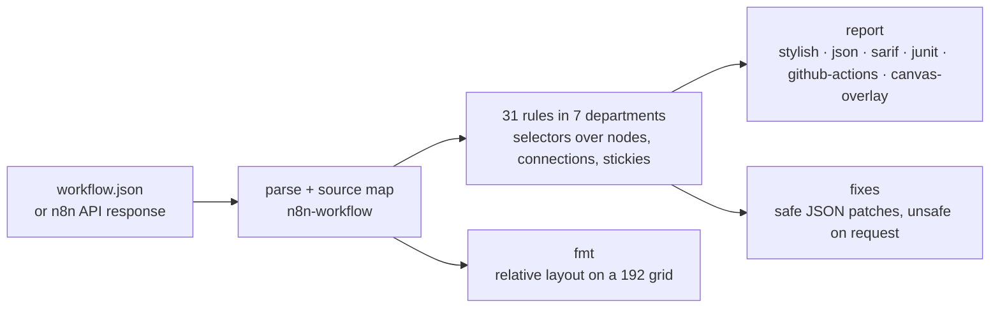

# workflow-lint

> A linter and formatter for workflow JSON. n8n is the first supported platform.

[](https://github.com/LudwigGerdes/workflow-lint/actions/workflows/ci.yml)
[](./LICENSE)
[](#compatibility)


<details><summary>Text transcript</summary>

```
── 1. Lint a workflow that is wrong in several ways ──────────────────────

$ workflow-lint lint order-sync.json --n8n-version 2.38.3
order-sync.json
  4:5   info   reliability/webhook-input-contract               Webhook "Order Received" accepts its payload without checking it; validate the required fields and stop on bad input.
  17:5  warn   naming/decision-node-question-mark               Decision node "Is Valid" should be phrased as a question ending in "?".
  27:5  warn   hygiene/no-placeholder-api-url                   Node "HTTP Request" still points at the placeholder URL "https://api.example.com/orders".
  27:5  warn   n8n/typeversion-policy                           Node "HTTP Request" uses typeVersion 4.2; the current version is 4.5.
  27:5  warn   naming/external-node-name-format                 Node "HTTP Request" calls an external service; name it to match ^(GET|POST|PUT|PATCH|DELETE|UPSERT) .+ - .+$.
  27:5  warn   naming/no-default-node-name                      Node "HTTP Request" still has its default name; rename it to describe what it does.
  27:5  warn   reliability/http-retry-config                    Node "HTTP Request" calls out over the network but does not retry on failure.
  27:5  warn   structure/branch-entry-pass-through              Branch 0 of "Is Valid" goes straight into "HTTP Request"; open it with a NoOp or a pass-through Set.
  40:5  warn   naming/no-default-node-name                      Node "Edit Fields" still has its default name; rename it to describe what it does.
  40:5  warn   structure/branch-entry-pass-through              Pass-through Set "Edit Fields" on branch 1 of "Is Valid" does not set includeOtherFields, so it drops the incoming data.
  40:5  error  structure/set-pass-through-include-other-fields  Pass-through Set "Edit Fields" assigns nothing and does not set includeOtherFields, so it emits empty items.

x 11 problems (1 error, 9 warnings, 1 info)  4 fixable with --fix
exit 1
Exit 1: one finding is an error, and --fail-on defaults to error.

── 2. Safe autofix, and what it deliberately leaves alone ────────────────

$ workflow-lint lint order-sync.json --fix
order-sync.json
  4:5   info  reliability/webhook-input-contract   Webhook "Order Received" accepts its payload without checking it; validate the required fields and stop on bad input.
  27:5  warn  hygiene/no-placeholder-api-url       Node "HTTP Request" still points at the placeholder URL "https://api.example.com/orders".
  27:5  warn  n8n/typeversion-policy               Node "HTTP Request" uses typeVersion 4.2; the current version is 4.5.
  27:5  warn  naming/external-node-name-format     Node "HTTP Request" calls an external service; name it to match ^(GET|POST|PUT|PATCH|DELETE|UPSERT) .+ - .+$.
  27:5  warn  naming/no-default-node-name          Node "HTTP Request" still has its default name; rename it to describe what it does.
  27:5  warn  structure/branch-entry-pass-through  Branch 0 of "Is Valid?" goes straight into "HTTP Request"; open it with a NoOp or a pass-through Set.
  43:5  warn  naming/no-default-node-name          Node "Edit Fields" still has its default name; rename it to describe what it does.

x 7 problems (0 errors, 6 warnings, 1 info)  1 fixable with --fix
exit 0
  "Is Valid" renamed to "Is Valid?" — and the connection
  key moved with it: Order Received, Is Valid?
  The placeholder URL is NOT auto-fixed: no safe value exists.
```
</details>

## Why

An n8n workflow is a JSON file that is only ever checked by running it. A default node name, a placeholder URL, an HTTP call with no retry or a Set node that silently emits empty items all import without complaint and fail at three in the morning, or worse, pass quietly. workflow-lint reads the JSON the way n8n does, reports each of those on the line where it lives, fixes the ones that have one safe fix, and does the same from a pre-commit hook, a CI job or an AI agent over MCP.

## Quickstart

Requires Node >= 24 (see [Compatibility](#compatibility) for why). The whole tool is one npm package, `workflow-lint` — the CLI, the MCP server (`workflow-lint-mcp`), the rule-author API and the n8n 2.38.3 node descriptions, so it works offline straight after install:

```bash
npx workflow-lint lint path/to/workflow.json --n8n-version 2.38.3
npm install --save-dev workflow-lint     # or pin it in a project
```

To work on the tool itself, build from a checkout (pnpm 10):

```bash
git clone https://github.com/LudwigGerdes/workflow-lint && cd workflow-lint
pnpm install && pnpm build
pnpm demo
```

**Run `pnpm demo` first.** It is a nine-part narrated tour — lint, fix, exit codes, `fmt`, reporters, baseline, node-type bundles, rule metadata and the MCP server — on `docs/demo/order-sync.json`, a workflow that is wrong on purpose. It rebuilds, takes about twenty seconds, and ends with `workspace kept for poking at: <path>`; that is a throwaway `workflow-lint-demo-*` directory under your OS temp dir (`/var/folders/…/T/` on macOS, `/tmp` on Linux), which you can delete whenever.

Then lint a file yourself. The CLI is `node packages/cli/dist/bin.js`; the rest of this README writes `workflow-lint` for it, so set the alias once:

```bash
alias workflow-lint="node $PWD/packages/cli/dist/bin.js"
```

```
$ node packages/cli/dist/bin.js lint docs/demo/order-sync.json --n8n-version 2.38.3
docs/demo/order-sync.json
  4:5   info   reliability/webhook-input-contract               Webhook "Order Received" accepts its payload without checking it; validate the required fields and stop on bad input.
  17:5  warn   naming/decision-node-question-mark               Decision node "Is Valid" should be phrased as a question ending in "?".
  27:5  warn   hygiene/no-placeholder-api-url                   Node "HTTP Request" still points at the placeholder URL "https://api.example.com/orders".
  27:5  warn   n8n/typeversion-policy                           Node "HTTP Request" uses typeVersion 4.2; the current version is 4.5.
  27:5  warn   naming/external-node-name-format                 Node "HTTP Request" calls an external service; name it to match ^(GET|POST|PUT|PATCH|DELETE|UPSERT) .+ - .+$.
  27:5  warn   naming/no-default-node-name                      Node "HTTP Request" still has its default name; rename it to describe what it does.
  27:5  warn   reliability/http-retry-config                    Node "HTTP Request" calls out over the network but does not retry on failure.
  27:5  warn   structure/branch-entry-pass-through              Branch 0 of "Is Valid" goes straight into "HTTP Request"; open it with a NoOp or a pass-through Set.
  40:5  warn   naming/no-default-node-name                      Node "Edit Fields" still has its default name; rename it to describe what it does.
  40:5  warn   structure/branch-entry-pass-through              Pass-through Set "Edit Fields" on branch 1 of "Is Valid" does not set includeOtherFields, so it drops the incoming data.
  40:5  error  structure/set-pass-through-include-other-fields  Pass-through Set "Edit Fields" assigns nothing and does not set includeOtherFields, so it emits empty items.

x 11 problems (1 error, 9 warnings, 1 info)  4 fixable with --fix
[exit 1]
```

Exit 1 because one finding is an `error` and `--fail-on` defaults to `error`. Of the four fixable findings, `--fix` applies the three safe ones (the `typeVersion` bump needs `--fix-unsafe`); the placeholder URL stays, because no safe value exists for it.

Works fully offline: node descriptions for one n8n version ship in the package, and no command contacts the network unless you ask for another version with `node-types install`.

## What it does

- **As an n8n builder, I want** my workflow checked before I import it **so that** a default node name, a placeholder URL or a Set node that drops its input is caught in review, not in production → `naming/*`, `hygiene/*`, `structure/*`
- **As an n8n builder, I want** every network call to retry and every webhook to validate its input **so that** a flaky upstream does not become an incident → `reliability/*`
- **As someone pinning an n8n version, I want** to know when a node's `typeVersion` lags or exceeds what my instance knows **so that** an import that "works" does not fail on first run → `n8n/typeversion-policy`, `n8n/typeversion-drift`
- **As a team lead, I want** one rule set in pre-commit, CI and code review **so that** every workflow in the repo meets the same standard → lefthook recipe, GitHub Action, SARIF/JUnit reporters
- **As someone adopting a linter on an existing repo, I want** to accept today's findings and fail only on new ones **so that** adoption does not start with a week of cleanup → `--gen-baseline`
- **As someone using an AI agent to build workflows, I want** it to run the same deterministic checks **so that** it fixes what the linter found rather than guessing from prose → MCP server
- **As an n8n builder, I want** the canvas laid out consistently **so that** diffs show logic changes, not dragging → `workflow-lint fmt`

Thirty-one rules across seven departments (`n8n`, `naming`, `structure`, `reliability`, `data`, `hygiene`, `layout`), each documented under [docs/rules](./docs/rules/README.md). The pages are generated from rule metadata, so they cannot drift from the code.

## How it works



workflow-lint parses the file with a source map, builds the same graph n8n does using n8n's own `n8n-workflow` package plus a bundle of n8n's node descriptions, runs each rule's selectors over it, and prints findings at the line and column where they live. `--fix` applies patches that preserve behaviour and re-runs until the document stops changing; `--fix-unsafe` adds the one fix that may change behaviour, and only when the node validates before and after. `fmt` is a separate command that owns layout, the way Prettier is separate from ESLint. It never runs the workflow, never contacts your n8n instance, and writes to disk only when you pass `--fix`, run `fmt` without `--check`, or ask for a baseline or config file.

## Compatibility

| | Version | Notes |
|---|---|---|
| n8n tested against | 2.38.3 | The bundled node descriptions; also the default when nothing is pinned |
| Node-type bundle | 2.38.3 (`n8n-nodes-base@2.38.1`, `@n8n/n8n-nodes-langchain@2.38.1`) | Ships inside the npm package as `versions/2.38.3/` (from `packages/node-types/versions/2.38.3/` in the repo); provenance in its [README](./packages/node-types/versions/README.md) |
| Other n8n versions | `workflow-lint node-types install <version>` | Downloaded from the npm registry into `~/.workflow-lint/`, sha512-verified; best effort |
| Node.js | >= 24 | CI runs 24 and 26. `n8n-workflow` 2.38 depends, through `@n8n/expression-runtime`, on the native module `isolated-vm` 7, which supports Node 24 and newer only (prebuilt binaries for Node 24 and 26; it cannot build on Node 20). workflow-lint never loads that module, but npm has to install it, so Node 24 is the floor. n8n 2.38 itself needs Node 24 when run from npm, so this matches the platform. |
| pnpm | 10 | `packageManager` in `package.json` pins 10.22.0 |

Workflow JSON from n8n 1.x lints too, but the rules read node semantics from the bundle you pin, so install the matching version for exact `typeVersion` findings.

## Usage

From `workflow-lint --help`:

| Command | What it does |
|---|---|
| `workflow-lint lint [paths...]` | Lint workflow JSON files (default `.`; `-` reads stdin) |
| `workflow-lint fmt [paths...]` | Format workflow layout |
| `workflow-lint init` | Write a starter `workflow-lint.config.yaml` |
| `workflow-lint rules [--json]` | List every available rule |
| `workflow-lint node-types list [--json]` | List bundled and installed n8n versions |
| `workflow-lint node-types install <version> [--force]` | Install a version into the `~/.workflow-lint` cache, downloading it from npm if it is not shipped |
| `workflow-lint node-types diff <a> <b>` | Compare two installed versions structurally |
| `workflow-lint fleet <manifest> [--full]` | Derive per-directory n8n version overrides from a fleet manifest |
| `workflow-lint --version` | Print the version |

A bare path is routed to `lint`, so `workflow-lint workflows/` is `workflow-lint lint workflows/`. Every command has `--help`.

### lint

```bash
workflow-lint lint                      # every workflow under the current directory
workflow-lint lint workflows/ orders.json
workflow-lint lint --fix                # apply safe fixes in place
workflow-lint lint --format json        # machine-readable report
curl -s "$N8N/api/v1/workflows/42" | workflow-lint lint -
```

An n8n API response (`{ "data": { … } }`) is accepted wherever a workflow export is, so piping straight from the API works.

| Option | Meaning |
|---|---|
| `--config <path>` | Config file to use instead of the discovered `workflow-lint.config.yaml` |
| `--format <f>` | `stylish` (default), `json`, `sarif`, `junit`, `github-actions`, `canvas-overlay` |
| `--fail-on <level>` | Lowest severity that fails the run: `info`, `warn`, `error` (default) |
| `--n8n-version <v>` | n8n version to lint against; overrides `settings.n8nVersion` |
| `--fix` / `--fix-unsafe` | Apply safe fixes, or also those marked unsafe |
| `--fix-type <types>` | Limit `--fix` to these kinds: `params`, `layout`, `connections` (comma-separated) |
| `--require-fixable-clean` | Fail when a finding remains that `--fix` could resolve |
| `--rule <id>` | Run only this rule; repeatable |
| `--class <class>` | Run only rules of this class: `stylistic` or `quality` |
| `--fail-on-stylistic` | Let stylistic findings fail the run (by default they never do) |
| `-l, --list-different` | Print only the paths of files that fail the run |
| `--log-level <level>` | `silent`, `error`, `warn`, `log` (default) or `debug`; diagnostics go to stderr |
| `--quiet` | Report errors only |
| `--max-warnings <n>` | Fail when warnings exceed this count |
| `--gen-baseline` | Record current findings as the accepted baseline |
| `--ignore-baseline` | Report every finding, baselined or not |
| `--baseline <path>` | Baseline file to use (default `.workflow-lint-baseline.yaml`) |
| `--no-ignore` | Lint ignored files too (config `ignore` + `.gitignore`) |
| `--no-error-on-unmatched-pattern` | Skip paths that do not exist instead of failing |

**Exit codes:** `0` clean · `1` findings at or above `--fail-on`, or warnings past `--max-warnings` · `2` a usage error, or a document that will not parse.

**What counts as a workflow.** A JSON object with a `nodes` array, or an n8n API response with `data.nodes`. A directory scan takes every `*.json` (minus `node_modules`, `package*.json`, `tsconfig*.json`, `*.config.json`, your `.gitignore` and the config's `ignore` list) and silently skips files that parse but are not workflows. A file you name explicitly is never skipped: if it is not a workflow, that is an error, so a hook or CI job can never pass having checked nothing.

```
$ workflow-lint --version
0.1.0

$ echo '{"hello": "world", "items": [1,2,3]}' > not-a-workflow.json
$ workflow-lint lint not-a-workflow.json
not-a-workflow.json
  1:1  error  parse-error  not an n8n workflow: no "nodes" array (expected a workflow export, or an n8n API response with "data.nodes")

x 1 problem (1 error, 0 warnings)
[exit 2]

$ workflow-lint fmt not-a-workflow.json --check
not-a-workflow.json: not an n8n workflow: no "nodes" array (expected a workflow export, or an n8n API response with "data.nodes")
[exit 2]

$ workflow-lint lint README.md          # non-JSON
README.md
  1:1  error  parse-error  invalid JSON: Unexpected token # in JSON at position 0

x 1 problem (1 error, 0 warnings)
[exit 2]
```

### Fixing

`--fix` applies **safe** fixes: renaming a decision node to end in `?` (propagated through connections and expressions), setting a pass-through Set's `includeOtherFields`, adding a retry block to an HTTP node. `--fix-unsafe` additionally applies fixes that may change behaviour — today only the `typeVersion` bump in `n8n/typeversion-policy`, which is withheld unless the node validates both before and after. Fixes re-run until the document stops changing, and every safe fix is checked for idempotency in the test suite.


<details><summary>Text transcript</summary>

```
$ workflow-lint lint flawed.json --n8n-version 2.38.3
flawed.json
  4:5   info  reliability/webhook-input-contract  Webhook "Webhook" accepts its payload without checking it; validate the required fields and stop on bad input.
  12:5  warn  hygiene/no-placeholder-api-url      Node "HTTP Request1" still points at the placeholder URL "=https://api.example.com/orders/{{ $jsn.body.id }}".
  12:5  warn  n8n/typeversion-policy              Node "HTTP Request1" uses typeVersion 4.2; the current version is 4.5.
  12:5  warn  naming/external-node-name-format    Node "HTTP Request1" calls an external service; name it to match ^(GET|POST|PUT|PATCH|DELETE|UPSERT) .+ - .+$.
  12:5  warn  naming/no-default-node-name         Node "HTTP Request1" still has its default name; rename it to describe what it does.
  12:5  warn  reliability/http-retry-config       Node "HTTP Request1" calls out over the network but does not retry on failure.
  23:5  warn  naming/no-default-node-name         Node "Edit Fields" still has its default name; rename it to describe what it does.
  34:5  warn  naming/no-default-node-name         Node "Code" still has its default name; rename it to describe what it does.
  42:5  warn  n8n/typeversion-policy              Node "Notify Slack" uses typeVersion 4.2; the current version is 4.5.
  42:5  warn  naming/external-node-name-format    Node "Notify Slack" calls an external service; name it to match ^(GET|POST|PUT|PATCH|DELETE|UPSERT) .+ - .+$.
  42:5  warn  reliability/http-retry-config       Node "Notify Slack" calls out over the network but does not retry on failure.
  42:5  warn  structure/no-dangling-node          Node "Notify Slack" stops here while the workflow continues elsewhere; its output goes nowhere.

x 12 problems (0 errors, 11 warnings, 1 info)  4 fixable with --fix
[exit 0]

$ workflow-lint lint flawed.json --fix-unsafe --n8n-version 2.38.3 --quiet
[exit 0]
$ git diff flawed.json        # (abridged)
-      "typeVersion": 4.2,
+      "typeVersion": 4.5,
+      "retryOnFail": true,
+      "maxTries": 3,
+      "waitBetweenTries": 500
```
</details>

### fmt

```bash
workflow-lint fmt                  # lay out every workflow under here
workflow-lint fmt --check          # exit 1 if anything would change; writes nothing
workflow-lint fmt -l               # only the paths that would change
workflow-lint fmt --stickies       # also resize sticky notes around their nodes
```

`fmt` normalises **relative** geometry, never absolute placement. Each entry node keeps exactly where you put it, and everything downstream follows from it: columns on a 192 grid, decision arms spread symmetrically about their own decision, chains holding their row, converging paths centred between their inputs, and sub-nodes hung below the node they feed. Anything it does not recognise — loop bodies, and any fan-out from a node that is not an IF or Switch — is left exactly as you drew it. Sticky resizing is off by default for the same reason.

`fmt` also owns the file's JSON serialisation: it rewrites the file as two-space-indented JSON with a trailing newline, so a compact one-line `parameters` object comes back multi-line. Formatting is idempotent. The same diff is available as a lint finding, `layout/formatted`, which is off by default; enable it with `rules: { layout/formatted: warn }`.

`fmt` takes `--n8n-version`, `--log-level`, `--no-ignore` and `--no-error-on-unmatched-pattern` with the same meaning as `lint`.

## Configuration

`workflow-lint init` writes `workflow-lint.config.yaml` with every block commented, including the ignore-versus-baseline trade-off. Without a config, `lint` uses `workflow-lint:recommended`. A filled-in example:

```yaml
extends:
  - workflow-lint:recommended

settings:
  n8nVersion: 2.38.3

departments:
  hygiene: error

rules:
  naming/external-node-name-format: off
  naming/no-default-node-name: [error, { allowTriggers: false }]

ignore:
  - "**/*.generated.json"
  - path: "workflows/vendor/**"
    reason: "vendor-shipped, regenerated on upgrade"

overrides:
  - files: ["workflows/legacy/**"]
    reason: "pre-standards, frozen until rewritten"
    departments:
      naming: off
  - workflows:
      tags: [experimental]
    rules:
      hygiene/no-placeholder-api-url: off
```

**Presets.** `workflow-lint:recommended` runs each rule at its own level. `workflow-lint:production` raises the findings that become incidents (`n8n/valid`, `hygiene/no-inline-secrets`, `reliability/http-retry-config`) to error, lifts `reliability/webhook-input-contract` to warn, and enables `reliability/error-workflow-configured`, which sits outside `recommended` because an example or a sub-workflow legitimately has no error workflow. `workflow-lint:strict` raises everything to error. An explicit rule always beats its department, and overrides apply last.

**Pin `settings.n8nVersion`.** Without it, version-sensitive findings are reported as information only, because the target instance is unknown, and `n8n/typeversion-policy` says so on every run. If the pinned version is not installed, lint continues against the nearest one it has and says which on stderr:

```
workflow-lint: n8n 1.50.0 not installed and nothing older is; using newer 2.38.3, which may describe nodes the instance lacks — run `workflow-lint node-types install 1.50.0` for exact results
```

**Suppressing findings.** n8n workflows have no comments, so directives live in a node's `notes` field, or as the first non-heading line of a sticky note, covering the nodes inside its bounds:

```
workflow-lint-disable naming/no-default-node-name -- renaming next sprint
workflow-lint-disable naming, structure/merge-for-reconvergence
workflow-lint-disable-file *
```

**Baseline.** Adopting the linter on an existing project need not mean fixing everything first:

```bash
workflow-lint lint --gen-baseline   # accept what is there today
workflow-lint lint                  # from now on, only new findings fail
workflow-lint lint --ignore-baseline
```

The baseline records a count per file, node and rule, so a second occurrence of an already-accepted rule on a new node still surfaces.

**Fleet.** One repo often holds the workflows of several n8n instances at different versions, one directory each. `workflow-lint fleet` turns a manifest naming each environment's directory and version into `overrides`, so each directory is linted against the n8n it actually runs. Extra fields in the manifest are ignored, so a deployment manifest that already has these keys can be passed as-is:

```json
{
  "n8nVersion": "2.38.3",
  "instances": [
    { "name": "dev", "directory": "dev" },
    { "name": "prod", "directory": "prod", "n8nVersion": "2.36.8" },
    { "name": "sandbox", "directory": "sandbox", "versionPolicy": "floating" }
  ]
}
```

```
$ workflow-lint fleet instances.json
overrides:
  - files:
      - dev/**
    reason: targets the n8n running on dev
    settings:
      n8nVersion: 2.38.3
  - files:
      - prod/**
    reason: targets the n8n running on prod
    settings:
      n8nVersion: 2.36.8
workflow-lint: 1 environment skipped, with no known version: sandbox
```

Append it to your config (`workflow-lint fleet instances.json >> workflow-lint.config.yaml`), or pass `--full` for a complete config. An environment on a floating version is skipped, and named on stderr, rather than guessed.

### Node-type bundles

One n8n version's node descriptions ship in the package (see [Compatibility](#compatibility)). Any other is installed on demand into `~/.workflow-lint/node-types/<version>/` (override the root with `WORKFLOW_LINT_HOME`), which is searched before the shipped copy. `node-types list --json` adds a `dirs` map saying where each version was found, and `WORKFLOW_LINT_DATA_DIR` points the shipped-copy lookup at a directory of your own:

```
$ workflow-lint node-types list
2.38.3*
$ workflow-lint node-types install 2.36.8
Downloading n8n 2.36.8 node types from the npm registry...
Installed n8n 2.36.8 node types to ~/.workflow-lint/node-types/2.36.8
```

`install` resolves the exact `n8n-nodes-base` and `@n8n/n8n-nodes-langchain` versions that n8n release depends on, checks each tarball against the registry's sha512 integrity hash, and extracts only `nodes.json`. It is the only command in the CLI that touches the network.

`node-types diff <a> <b> [--format text|md|json] [--only <nodeType>] [--ignore-generated-defaults]` compares two installed versions: nodes added, removed or newly hidden, `defaultVersion` bumps, new `typeVersion`s, credential and input/output changes, and property additions, removals, retypes and default changes, attributed to the `typeVersion`s each one affects. Rename detection is out of scope, so a renamed property shows as a removal plus an addition. Some nodes declare relative-date defaults that are regenerated on every build; `--ignore-generated-defaults` drops those. `pnpm demo` section 7 shows the output on two tiny synthetic bundles.

### Reporters

| `--format` | Use |
|---|---|
| `stylish` | Humans at a terminal (default) |
| `json` | Scripts; `ruleId`, `messageId`, `nodeId`, `loc`, `data` per finding, plus a summary |
| `sarif` | GitHub code scanning; suggested fixes included |
| `junit` | GitLab and most CI runners; only findings at or above `--fail-on` become failures, the rest are recorded as notes |
| `github-actions` | Inline annotations on a pull request, no upload step |
| `canvas-overlay` | Badges per node for a canvas renderer (workflow-render); the shape is reserved, nothing renders it yet |

## Editor, CI and AI integration

### GitHub Action

`action.yml` is a composite action. It builds from its own checkout (`pnpm install --frozen-lockfile && pnpm build`) before linting — expect the first step to take a minute; a later release will switch it to `npx workflow-lint@<version>` and skip the build. It defaults to `--format github-actions`, so findings arrive as annotations on the changed lines.

```yaml
- uses: LudwigGerdes/workflow-lint@main
  with:
    paths: workflows/
    n8n-version: 2.38.3
    fail-on: error        # info | warn | error
    # config: workflow-lint.config.yaml
    # format: github-actions | stylish | json | sarif | junit
```

For code scanning instead, use the checkout invocation and upload SARIF:

```yaml
- run: node workflow-lint/packages/cli/dist/bin.js lint workflows/ --format sarif > workflow-lint.sarif
  continue-on-error: true
- uses: github/codeql-action/upload-sarif@v3
  with:
    sarif_file: workflow-lint.sarif
```

### Pre-commit (lefthook)

`lefthook.yml` in this repo is the recipe. Install with `npx lefthook install`; it runs `lint --fail-on error` and `fmt --check` in parallel over staged workflow JSON.


<details><summary>Text transcript</summary>

```
$ npx lefthook install
sync hooks: ✔️(pre-commit)

$ git add workflows && git commit -m "add order intake workflow"
╭───────────────────────────────────────╮
│ lefthook  v2.1.14   hook:  pre-commit │
╰───────────────────────────────────────╯
┃  format-workflows ❯
workflows/flawed.json  3 nodes moved

1 file would be reformatted

exit status 1
┃  lint-workflows ❯
workflows/flawed.json
  1:1   warn  n8n/typeversion-policy              No n8n version is pinned, so version findings were reported as information only; set settings.n8nVersion to enforce them.
  4:5   info  reliability/webhook-input-contract  Webhook "Webhook" accepts its payload without checking it; validate the required fields and stop on bad input.
  12:5  warn  hygiene/no-placeholder-api-url      Node "HTTP Request1" still points at the placeholder URL "=https://api.example.com/orders/{{ $jsn.body.id }}".
  ...
  42:5  warn  structure/no-dangling-node          Node "Notify Slack" stops here while the workflow continues elsewhere; its output goes nowhere.

x 11 problems (0 errors, 10 warnings, 1 info)  2 fixable with --fix

  ────────────────────────────────────
summary: (done in 0.56 seconds)
✓ lint-workflows (0.54 seconds)
✗ format-workflows (0.53 seconds)
[commit exit 1]
```
</details>

Two details matter if you adapt it. The glob must be `*.json`: a file named explicitly is linted whatever its extension, so a staged README or a non-workflow JSON would be reported as an error. And both commands need `--no-error-on-unmatched-pattern`, because the staged-file list includes paths deleted in the same commit — without it, removing a workflow fails its own hook. The husky equivalent has to filter deleted paths itself:

```sh
# .husky/pre-commit — NUL-delimited so paths with spaces survive
git diff --cached --name-only -z --diff-filter=d -- '*.json' \
  | xargs -0 -r node packages/cli/dist/bin.js lint --fail-on error --no-error-on-unmatched-pattern
git diff --cached --name-only -z --diff-filter=d -- '*.json' \
  | xargs -0 -r node packages/cli/dist/bin.js fmt --check --no-error-on-unmatched-pattern
```

### MCP server

`workflow-lint-mcp` is a stdio MCP server that ships in the same package as the CLI, so an agent applies exactly the checks the CLI does rather than approximating them from prose. Claude Code, Cursor and similar take the same shape:

```json
{
  "mcpServers": {
    "workflow-lint": {
      "command": "npx",
      "args": ["-y", "-p", "workflow-lint", "workflow-lint-mcp"],
      "env": { "WORKFLOW_LINT_N8N_VERSION": "2.38.3" }
    }
  }
}
```

From a checkout, use `"command": "node", "args": ["/path/to/workflow-lint/packages/cli/dist/mcp.js"]` instead.

| Tool | Returns |
|---|---|
| `lint_workflow` | `{ path, findings[], summary: { errors, warnings, infos } }` |
| `fix_workflow` | `{ path, json, changed, remaining[] }` — safe fixes applied; `unsafe: true` adds the rest |
| `format_workflow` | `{ path, json, moved, changed }`; `stickies: true` also resizes sticky notes |
| `list_rules` | Every rule, its level and whether it is fixable |
| `explain_rule` | One rule's reference page, from its metadata |

The three workflow tools take exactly one of `json` (the workflow as an object; a JSON string is parsed first), `path` (relative to the server's working directory, which it may not escape) or `instance` + `workflowId`. Anything that cannot be linted — not JSON, not a workflow, a refused source — comes back as an MCP error result, never as a clean summary:

```
# tools/call lint_workflow  { "json": "{\"hello\":\"world\"}" }   -- a non-workflow, sent as a string
{
  "isError": true,
  "text": "cannot lint <inline>: workflow must be an object with a \"nodes\" array"
}

# tools/call lint_workflow  { "json": { "hello": "world" } }
{
  "isError": true,
  "text": "cannot lint <inline>: workflow must be an object with a \"nodes\" array"
}

# tools/call lint_workflow  { "instance": "https://evil.example", "workflowId": "1" }
{
  "isError": true,
  "text": "instance access is not enabled on this server"
}
```

**Instance access is off unless you turn it on, and pinned when you do.** It needs both `WORKFLOW_LINT_N8N_API_KEY` and `WORKFLOW_LINT_N8N_INSTANCE`:

```json
"env": {
  "WORKFLOW_LINT_N8N_API_KEY": "…",
  "WORKFLOW_LINT_N8N_INSTANCE": "https://n8n.example.com"
}
```

The server then fetches only from that instance; naming any other host is refused before a request is made, so the key cannot be steered elsewhere by a caller acting on untrusted workflow content. See [SECURITY.md](./SECURITY.md) for what handles secrets.

## Programmatic use

The package has three entry points, all ESM with types, and all sharing one module instance with the CLI (a `Rule` you build against `workflow-lint/core` is the type `RuleTester` and the CLI's engine accept):

| Import | For |
|---|---|
| `workflow-lint/core` | Rule authors and tool builders: `lint`, `resolveConfig`, `parseWorkflow`, `LintGraph`, `Fixer`, and the `Rule` / `RuleContext` / `Finding` types |
| `workflow-lint/rule-tester` | `RuleTester`, the ESLint-style fixture runner. It registers vitest `describe`/`it` blocks, so `vitest` is an optional peer dependency needed only here |
| `workflow-lint` | `buildProgram()` and the reporters, for embedding the CLI |

```js
import { readFileSync } from 'node:fs';
import { lint, resolveConfig } from 'workflow-lint/core';

const rule = {
  meta: {
    id: 'acme/no-http-request', type: 'problem', class: 'quality', fixable: null,
    docs: { description: 'Acme forbids raw HTTP Request nodes.', recommended: 'error' },
    messages: { found: 'HTTP Request node "{{name}}" is not allowed.' },
  },
  create: (ctx) => ({
    'Node[type="n8n-nodes-base.httpRequest"]': (node) =>
      ctx.report({ node, messageId: 'found', data: { name: node.name } }),
  }),
};

const config = resolveConfig(
  { settings: { n8nVersion: '2.38.3' }, rules: { [rule.meta.id]: 'error' } },
  new Map([[rule.meta.id, rule]]),
);
const path = 'workflow.json';
const { findings } = await lint({ text: readFileSync(path, 'utf8'), path }, config);
```

`pnpm smoke` runs exactly this against an installed tarball, type-checks it with `tsc`, and runs a `RuleTester` suite under a consumer's vitest. The CLI does not load third-party rules from config yet; this API is how you run them today.

## Why not …?

| Alternative | What it gives you | Use it instead when… |
|---|---|---|
| n8n's own validation | Parameter and connection validity for the version you run, in the editor, at save time | You only need "will it import"; n8n does not check names, retries, placeholders, dangling nodes or layout, and it needs a running instance |
| n8n-mcp `validate_*` tools | Node-configuration checks for an agent building workflows, backed by a node database | Your agent already runs n8n-mcp and you want validation inside that loop; workflow-lint adds the graph-level rules, a CLI, CI and a fixer |
| [n8nlint](https://github.com/jan-nikolov/n8nlint) | An MIT-licensed CLI with 14 rules aimed at runtime-bug patterns in n8n workflows, such as a Merge inside a batch loop or a missing loop-back, with JSON output for CI | You want a small, focused check for those specific patterns; workflow-lint adds autofix, a formatter, a pre-commit hook, a GitHub Action, an MCP server and SARIF/JUnit output, and validates against n8n's own parser and node descriptions rather than a separate graph model |
| [FlowLint](https://github.com/Replikanti/flowlint-core) | A static analysis engine for n8n workflows, published as a core library with a separate CLI | Its rule set or its library API fits your setup better; the two were written independently and share no code or fixtures |
| Hand review | Judgement: is this the right design, does it handle the business case | Always, for the judgement calls; workflow-lint is deliberately static-only so review time goes on those rather than on default names |
| A JSON Schema check | Shape validation of the export | You need nothing more than shape; workflow-lint uses n8n's own parser and node descriptions, so it knows what a `typeVersion` means |

## FAQ

**Does it change my workflow?** Only when you ask. `lint` reads; `lint --fix` writes the file back with safe patches; `fmt` (without `--check`) rewrites positions and re-serialises the JSON. `--fix-unsafe` is the single opt-in that may change behaviour.

**Does it need my n8n instance?** No. Every command is static and offline. The MCP server can read from one pinned instance if you give it a key; nothing else contacts anything.

**Which n8n versions?** Node descriptions for 2.38.3 ship inside; `node-types install <version>` fetches others. Pin `settings.n8nVersion` (or `--n8n-version`) or version findings are advisory only.

**Why did a rule fire?** `workflow-lint rules` lists every rule with its class, level and one-line rationale; `docs/rules/<department>/<rule>.md` has the long form, options and fix behaviour. Over MCP, `explain_rule` returns the same page.

**What does it not check?** Expression contents (`{{ $jsn.body.id }}` is not flagged as a typo), code inside Code nodes, credential validity, and anything that needs the workflow to run. Those are judgement or runtime, and are left to a human or an agent reading the findings.

**Why is my `*.json` data file suddenly an error?** Because you named it on the command line. A directory scan skips JSON that is not a workflow; an explicit path is always checked, so a hook cannot pass by accident. Point the hook's glob at your workflow directory if that gets in the way.

## Known issues

- `n8n/typeversion-policy` reports "No n8n version is pinned" at `warn`, while its text says findings were "reported as information only"; the severity and the sentence disagree, and it fires at `1:1` of every file in an unpinned repo. Pin `settings.n8nVersion` to silence it.
- The MCP `json` argument has no declared type in the tool schema (it accepts an object, and parses a string); the description says so but a strict client may not.
- `workflow-lint <unknown-command>` is treated as a path to lint and reports `no such file or directory`, because a bare path routes to `lint`.
- The GitHub Action builds the CLI from source on every run until an npm release exists; after that it switches to `npx workflow-lint@<version>`.

## Status

Feature-complete for a first release: 31 rules, safe and unsafe fixes, six reporters, baseline, `fmt`, pre-commit and GitHub Action recipes, MCP server, and a test suite that runs with the network namespace removed in CI. Not published to npm. Out of scope by design: running workflows, judging designs, and any rule that needs a live instance.

## Support and maintenance

workflow-lint is maintained by one person alongside other work. Bugs go to GitHub Issues (use the template and include your n8n version and a minimal workflow JSON). Questions go to Discussions. Expect a first response within about a week; nudge the thread if you hear nothing. Feature requests are welcome but not promised.

## Contributing

See [CONTRIBUTING.md](./CONTRIBUTING.md) and [AGENTS.md](./AGENTS.md) for the codebase guide. The loop is `pnpm install && pnpm verify` (build, typecheck, test); write the failing test first, and regenerate `docs/rules` with `pnpm docs:rules` when a rule's metadata changes.

## Related tools

Four standalone tools for workflow JSON, built by one maintainer. Each works on its own; together they cover the loop from lint to mock to test to render. n8n is the first supported platform.

| Tool | What it does |
|---|---|
| [workflow-lint](https://github.com/LudwigGerdes/workflow-lint) | Lint and format workflow JSON; pre-commit hook, GitHub Action, MCP server |
| [integration-mock](https://github.com/LudwigGerdes/integration-mock) | Mock the APIs a workflow's integrations call; snapshot real runs and replay them |
| [workflow-test](https://github.com/LudwigGerdes/workflow-test) | Generate and run contract tests from the payloads a trigger can receive |
| [workflow-render](https://github.com/LudwigGerdes/workflow-render) | Render workflow and execution JSON to SVG/PNG offline; embed and export |

Not affiliated with n8n GmbH.

## License

MIT © Ludwig Gerdes. See THIRD_PARTY_NOTICES.md for bundled n8n-derived data and other third-party material. Not affiliated with n8n GmbH.
